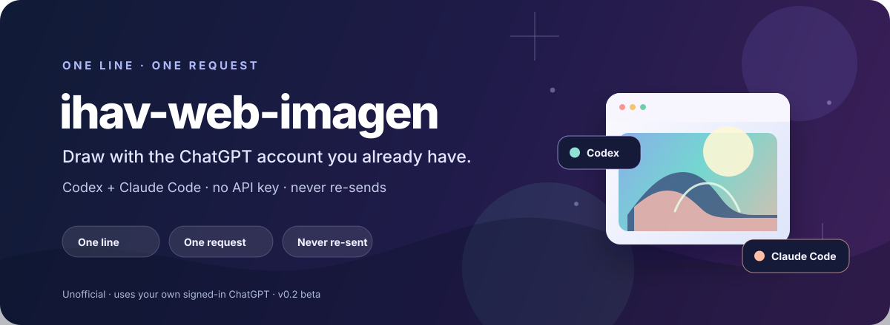
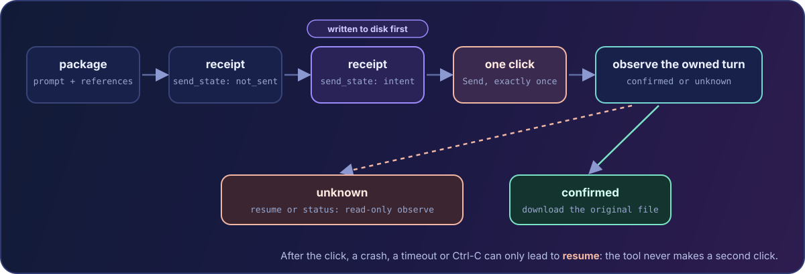

<p align="center">
  
</p>

<p align="center">
  
  
  
  <a href="LICENSE"></a>
</p>

<h1 align="center">ihav-web-imagen</h1>

<p align="center"><strong>Your coding agent. Your ChatGPT account. One image request.</strong><br>Describe an image in Claude Code or Codex. Save the original. Recover without sending again.</p>

<p align="center">
  <a href="#demo">🎬 Demo</a> ·
  <a href="#cases">🌟 Cases</a> ·
  <a href="#install">⚡ Install</a> ·
  <a href="#use">🎯 Use</a> ·
  <a href="#why">✨ Why</a> ·
  <a href="#never-resent">🛡️ Never re-sent</a> ·
  <a href="#status">✅ Status</a> ·
  <a href="#faq">❓ FAQ</a>
</p>

> [!IMPORTANT]
> **Beta · v0.2.0.** A dedicated local runtime for macOS and Linux, with one-time setup and sign-in. Setup downloads dependencies and a browser; it sends no image request. Fresh-machine image generation is not yet verified.
>
> **Unofficial.** Not affiliated with or endorsed by OpenAI or Anthropic. This plugin operates the rendered ChatGPT web UI with your signed-in account. That UI can change, image requests count against your plan, and automation may lead to account restrictions or suspension. See [Security](SECURITY.md) and [verified status](#status).

---

<a id="demo"></a>
## 🎬 See it in action

<p align="center">
  <picture>
    <source media="(prefers-reduced-motion: reduce)" srcset="assets/demo-still.jpg">
    
  </picture>
</p>

> **🎭 This is a re-enactment.** The command, the `~/art` folder, the terminal window and the line wrapping are illustrative, and the 54 s wait is skipped.
> The values and the image are from **one real run on 2026-10-01**, made on the maintainer's machine by an earlier build of the same engine. In that run
> the original file was saved and library-checked by a follow-up `resume`, not by the first command. The picture shows ChatGPT's output, not this tool's quality.

<table>
<tr>
<td width="42%" valign="top">
  <br>
  <sub>🖼️ The real file from the first v0.2.0 run, downscaled (the saved original is a 1370×1148 PNG). AI-generated by ChatGPT Images.</sub>
</td>
<td valign="top">
  <b>🧾 What the receipt recorded (v0.2.0, 2026-10-04)</b>
  <ul>
    <li><b>Prompt:</b> <code>a red fox</code>, your words, verbatim</li>
    <li><b>Sends:</b> exactly 1 click (<code>send_clicks: 1</code>)</li>
    <li><b>Timeline</b> (seconds since the browser run started): composer ready <b>4.4</b> → <i>intent written to disk</i> <b>4.6</b> → turn posted <b>5.8</b> → final image <b>34.3</b></li>
    <li><b>Intent to final image:</b> 29.7 s</li>
    <li><b>Saved:</b> the original PNG, 1370×1148, by a follow-up <code>resume</code> that sent nothing (the first command met a late Download button, fixed since but not yet proven live)</li>
    <li><b>Library check:</b> not passed that day; ChatGPT's library matching was ambiguous after a UI change</li>
    <li><b>Run id:</b> <code>a-red-fox-20261004T080818-ee26f08cf75a</code></li>
  </ul>
  <sub>The animation above re-enacts an earlier 2026-10-01 run (<code>a beautiful girl</code>, see <a href="assets/showcase/a-beautiful-girl.jpg">its image</a>).</sub>
</td>
</tr>
</table>

---

<a id="cases"></a>
## 🌟 Great cases

Every case says what is real: 🟢 a real run · 🟡 the real code run offline, against a scripted page or a recorded corpus (no browser, no ChatGPT request) · 🔵 a real command that sends nothing. These historical examples do not establish a fresh-machine v0.2.0 run (see [Status](#status)).

### 1. 🟢 One line, one wide scene

<details>
<summary><b>🌃 Show a dark sci-fi scene, 1672×941</b> (contains battle imagery)</summary>
<br>
<p align="center"></p>

The second real run on 2026-10-01, with the prompt <code>a nighmare of human by skynet</code> (typos kept: your words are used as written). The receipt: 1 click, intent to final image 52.8 s, original PNG 1672×941. As in the first run, a follow-up <code>resume</code> saved the file and matched its pixels to the Images library. AI-generated by ChatGPT Images; downscaled here.
</details>

### 2. 🟢 v0.2.0, the first run with the bundled runtime

<details>
<summary><b>🦊 Show the red fox, 1370×1148</b></summary>
<br>
<p align="center"></p>

A real run on 2026-10-04 with the prompt <code>a red fox</code>: 1 Send, intent to final image 29.7 s, original PNG 1370×1148, saved by a follow-up <code>resume</code> that sent nothing. AI-generated by ChatGPT Images; downscaled here.
</details>

### 3. 🔵 Edit from two references

```text
$ imagine.py "same pose, watercolor palette" --ref pose.png --ref palette.png --out ~/art --dry-run
Dry run: the package is valid. Would send 1 request with 2 reference(s) in cloakbrowser and save to ~/art.
  prompt (29 chars), references: ['1_pose.png', '2_palette.png']; nothing was sent, no browser started.
```
<sub>References are copied, hashed and kept in prompt order. A reference edit has not been run live yet, so no result image is shown.</sub>

### 4. 🔵 Mistakes are caught before they cost a request

```text
$ imagine.py "same pose, watercolor palette" --ref damaged.png --out ~/art --dry-run
No image saved: reference_image_invalid.
  Nothing was sent, so running the same command again after fixing the cause is safe.

$ imagine.py "a red fox" --out /nonexistent-root/sub --dry-run
Cannot save into /nonexistent-root/sub: / is not a writable folder. Nothing was sent.

$ imagine.py "a red fox" --ref a.png --ref b.png --ref c.png --out ~/art --dry-run
At most 2 reference images, in prompt order (got 3). Nothing was sent.
```
<sub>Real output; folder paths shortened. A real run makes the same checks before its one click.</sub>

### 5. 🟡 The click's acknowledgement is lost: never re-sent, then recovered

<p align="center">
  <picture>
    <source media="(prefers-reduced-motion: reduce)" srcset="assets/demo-recovery-still.jpg">
    
  </picture>
</p>

<sub>The real `generate` and `resume` commands run against a scripted page. The output is trimmed to the key fields, and the coloured comments are explanations.</sub>

### 6. 🟡 The image checks were measured against real decoders

Before a reference is uploaded, its structure is checked against what Chromium and Pillow really do, row by row ([`decoder_differential.json`](plugins/ihav-web-imagen/core/ihav-web-imagen/tests/decoder_differential.json), 69 rows; the Chromium column is re-measured on every test run). The rule: reject when a mainstream decoder rejects the file, when picture data is missing or cut short, or for a stated framing-sanity reason; accept what both decoders decode. A few real rows:

| File (mutated or genuine) | Chromium | Pillow | Preflight | Why |
|---|---|---|---|---|
| `png_duplicate_plte.png` | rejects | decodes | ⛔ rejects | a mainstream decoder rejects it |
| `png_idat_not_consecutive.png` | decodes | rejects | ⛔ rejects | a mainstream decoder rejects it |
| `jpg_empty_scan.jpg` | decodes | decodes | ⛔ rejects | picture data missing |
| `jpg_all_zero_ids.jpg` | decodes | decodes | ✅ accepts | both decoders decode it |
| `png_trailing_bytes_ok.png` | decodes | decodes | ✅ accepts | both decoders decode it |

---

<a id="install"></a>
## Install in 30 seconds; set up once

Choose your host:

```sh
# Claude Code
claude plugin marketplace add hiendang7613/ihav-web-imagen
claude plugin install ihav-web-imagen@ihav-web-imagen

# Codex
codex plugin marketplace add hiendang7613/ihav-web-imagen
codex plugin add ihav-web-imagen@ihav-web-imagen
```

In Claude Code, run the no-send setup skill:

```text
/ihav-web-imagen:setup
```

It runs setup and gives you a login command to run yourself. In Codex, ask your agent:

```text
Set up ihav-web-imagen with runtime.py setup, then run runtime.py login so I can sign in. Do not generate an image.
```

The agent resolves `scripts/runtime.py` inside the installed skill. Setup creates a private Python environment and downloads CloakBrowser Chromium (about 200 MB). The first download takes longer than installing the plugin. Login opens a visible window where **you** sign in to ChatGPT, then close the window. Neither command sends a prompt.

Now make a direct image request:

```text
# Claude Code
/ihav-web-imagen:imagine a red fox in watercolor

# Codex
$ihav-web-imagen:ihav-web-imagen a red fox in watercolor
```

**Requirements:** Python 3.11+ with `venv`, macOS or Linux on a platform with a CloakBrowser binary, internet access, and a ChatGPT account with image access. Login needs a graphical display. The current adapter expects English UI; Windows is not supported.

Prefer a shell installer? Read [`install.sh`](install.sh), then run `sh install.sh` from a clone. It calls the hosts' plugin commands; runtime setup remains separate.

See [How it works](docs/how-it-works.md#setup-and-sign-in) for exact setup commands from a clone.

---

<a id="use"></a>
## 🎯 Use

| Where | Say |
|---|---|
| 🟠 Claude Code | `/ihav-web-imagen:imagine a red fox in watercolor` |
| 🟣 Codex | `$ihav-web-imagen:ihav-web-imagen a red fox in watercolor` |

```text
Image saved: <folder>/<slug>-<timestamp>-<id>.png
  <width>x<height>  run <run id>  1 Send, generation <n> s
```
<sub>The shape of the output; the values come from your run.</sub>

Your words are used exactly as written. The image is saved in the folder you are in; the agent can choose another with `--out`:

| Option | What it does |
|---|---|
| `--out DIR` | where to save (default: the current directory; never overwrites) |
| `--ref IMAGE` | up to two reference images, in prompt order, for edits |
| `--browser chrome` | plain Google Chrome in a profile of its own instead of the default CloakBrowser; sign in once with `runtime.py login --browser chrome` (see [Two browsers](#browsers)) |
| `--dry-run` | validate the prompt, references and output folder and show the plan: no browser, **nothing is sent** (after setup) |
| `--verify-library` | also confirm the image appears in your ChatGPT Images library |
| `--wait-seconds N` | how long to wait for the image (default 480, maximum 1200) |
| `--name STEM` | file name stem (default: from your words) |
| `--json` | also print the machine-readable result |

---

<a id="why"></a>
## ✨ Why it is different

<table>
<tr>
<td width="33%" valign="top"><h4>🔐 Your account, your UI</h4>It drives the normal ChatGPT Images page in a dedicated headless browser profile you signed in to. No image API key. A generation counts against your ChatGPT plan; this plugin does not change your limits or subscription.</td>
<td width="33%" valign="top"><h4>🛡️ Never re-sent</h4>A durable receipt is written <i>before</i> the one click. If anything is uncertain the run is recovered read-only; the tool never clicks Send a second time. A run sends at most once.</td>
<td width="33%" valign="top"><h4>🖼️ The original file</h4>It saves the real image from the finished turn and checks its pixels against what the page rendered, not a preview.</td>
</tr>
<tr>
<td valign="top"><h4>🙋 Built to run only when asked</h4>The Claude Code image and setup skills are user-invoked only; the Codex image skill is set to explicit invocation only. Brainstorming a prompt or reviewing an image is not a request to send.</td>
<td valign="top"><h4>🧾 Errors an agent can act on</h4>Every failure has a kind and a <code>retry_safe</code> verdict, so the agent knows whether to fix and rerun, resume, or stop.</td>
<td valign="top"><h4>🧪 Tested before it touches your account</h4>The earlier engine had 259 offline tests, including a differential against Chromium and Pillow. Portable repository checks run separately; offline success does not prove a live ChatGPT run.</td>
</tr>
</table>

---

<a id="never-resent"></a>
## 🛡️ Never re-sent: the receipt lifeline

<p align="center">
  
</p>

| `send_state` | Meaning | Retry? |
|---|---|---|
| `not_sent` | nothing was clicked | ✅ safe, fix the cause and rerun |
| `intent` | written just before the click | ⛔ never (a command that ends normally turns it into `unknown` or `confirmed`) |
| `confirmed` | the posted turn with your exact prompt was found | ⛔ never; wait, `resume`, or download |
| `unknown` | a click may have happened, the turn was not verified | ⛔ never; `resume` observes the retained conversation read-only |

The guarantee is *at most one Send per run, never re-sent automatically*. Typing the command again is a *new* request, so the tool tells the agent not to. Details: [safety model](docs/safety-model.md) · [how it works](docs/how-it-works.md).

---

<a id="browsers"></a>
## Two browsers, separate profiles

CloakBrowser is the default. `runtime.py setup` installs pinned Python dependencies and downloads its Chromium build. The browser binary is not bundled in this repository.

`--browser chrome` selects plain Google Chrome with its own `chrome-profile`. Sign in with `runtime.py login --browser chrome` first. It never copies your everyday Chrome profile. Recovery retains the browser selected for the original run.

Both routes stop at sign-in or verification challenges. Historical live evidence covers CloakBrowser only; Chrome has offline coverage and has not been demonstrated live here.

---

## Compare: browser plugin or API-key tool?

| Choice | ihav-web-imagen | API-key image tool |
|---|---|---|
| Access | Your signed-in ChatGPT account | Provider API key |
| Usage | Your ChatGPT plan's quota | Provider API billing and limits |
| Setup | Local browser, private environment, manual sign-in | API credentials and client configuration |
| Interface | Rendered ChatGPT UI; changes can break it | Provider's documented API contract |
| Recovery | Durable receipt; at most one Send per run | Depends on the tool's request and retry handling |
| Best fit | A local agent using your existing ChatGPT account | An application needing a supported programmatic interface |

Choose a documented API when its operational contract fits your application. This plugin is an unofficial browser workflow, with the limits in [Security](SECURITY.md).

---

<a id="status"></a>
## Status: evidence before promises

| Evidence | What it establishes |
|---|---|
| **Historical live runs** | Two requests on 2026-10-01, on one macOS machine and one account, with an earlier engine. Each recorded one Send and one image. A follow-up `resume` saved the original PNG and matched its pixels to the Images library in both runs. |
| **Historical offline checks** | The earlier engine's 259-test suite exercised failure handling, recovery and image validation. Install/load checks used throwaway homes. These checks do not prove fresh-machine v0.2.0 operation. |
| **v0.2.0 runtime** | A vendored adapter and private environment target macOS and Linux. The maintainer reports setup in a fresh state directory in 13 s, followed by a successful no-send dry run. Chromium was already cached: a cold browser download and Linux operation are not yet verified. |
| **v0.2.0 live run** | One request on 2026-10-04 with this runtime, on the maintainer's macOS machine, after `runtime.py login`: `a red fox`, 1 Send, intent to final image 29.7 s, original PNG 1370×1148. ChatGPT had changed its UI that day; three earlier attempts stopped before any Send (`send_clicks: 0`) and were fixed first. The first command did not save the file: its Download button appeared late. A follow-up `resume` (no Send) saved the original after matching its pixels to the owned turn. The Images library match was ambiguous that day, so the library check did not pass. |
| **Not demonstrated live** | Reference-image edits, long prompts, parallel runs, Chrome, Linux image generation, and a first command saving the original without follow-up recovery (the 2026-10-04 fix for the late Download button is not yet proven live). |
| **Not promised** | Faster ChatGPT generation, unlimited images, exact dimensions, stable web markup, Windows support, or exactly-once delivery. The guarantee is at most one Send per run. |

Quota, sign-in, rate-limit, policy and verification blocks stop the run. The plugin does not retry it, rotate accounts, solve challenges or change providers. Library persistence is only reported after checking the matching item; use `--verify-library` to request that check.

---

## Roadmap

- [ ] Fresh-machine setup evidence for macOS and Linux, without sending test image requests
- [ ] Evidence from a user-requested run that saves its original in the first command
- [ ] More receipt-backed examples, including an explicitly requested reference edit
- [ ] Other UI languages and platforms, after verification

---

## 📚 Docs

[How it works](docs/how-it-works.md) · [Safety model](docs/safety-model.md) · [Security](SECURITY.md) · [Contributing](CONTRIBUTING.md) · [Changelog](CHANGELOG.md)

🛠️ Working on the repo itself? `python3 install.py` links the skill for Codex and writes a short `/ihav-web-imagen` command for Claude Code.

---

<a id="faq"></a>
## ❓ FAQ

<details>
<summary><b>Is this allowed?</b></summary>

Not checked for you. Automating a web UI may be against the service's terms and can get an account limited or suspended; use it at
your own risk, with an account you can afford to lose.
</details>

<details>
<summary><b>Can it send twice?</b></summary>

A run does not click Send a second time: see the [safety model](docs/safety-model.md). If the outcome is unknown you recover (`headless.py resume --run-id <same-id>`); you do not
retry. Typing the command again is a new request.
</details>

<details>
<summary><b>Why not the API?</b></summary>

If you have API budget, use the API. This is for people who already live in ChatGPT and want their agent to use it.
</details>

<details>
<summary><b>Will it use my everyday Chrome, my cookies or my passwords?</b></summary>

You sign in through a dedicated browser window. The browser stores its authenticated session locally; the plugin does not extract cookies or tokens, collect passwords, or copy your everyday profile.
</details>

---

<details>
<summary><b>Does setup generate an image? Can I check without spending a request?</b></summary>

`runtime.py setup` installs the runtime and browser; `runtime.py login` opens sign-in. Neither sends a prompt. `runtime.py doctor` reads local installation state. After setup, `--dry-run` validates the package and output folder without starting a browser or sending anything. A dry run does not prove your account can generate images.
</details>

<details>
<summary><b>Where are prompts, references and login stored?</b></summary>

Locally, under the dedicated state directory: `~/Library/Application Support/ihav-web-imagen` on macOS, or `${XDG_DATA_HOME:-~/.local/share}/ihav-web-imagen` on Linux. Override it with `IHAV_WEB_IMAGEN_HOME`. Run receipts retain prompts and references for recovery. Treat this directory as private; see [Security](SECURITY.md).
</details>

## The ihav family

Small plugins for Claude Code and Codex, each with a focused job:

- [ihav-asd-ste100](https://github.com/hiendang7613/ihav-asd-ste100): predictable, easy-to-scan agent replies.
- [ihav-agent-room](https://github.com/hiendang7613/ihav-agent-room): a shared room for cooperating Claude Code and Codex sessions.
- [ihav-marketplace](https://github.com/hiendang7613/ihav-marketplace): discover the family and its install instructions.

## License

[MIT](LICENSE) · Image in the demo: AI-generated with ChatGPT Images through this tool's engine.
